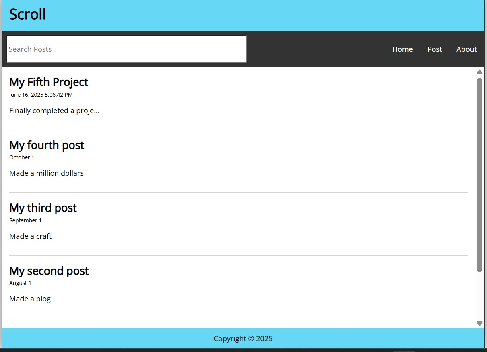
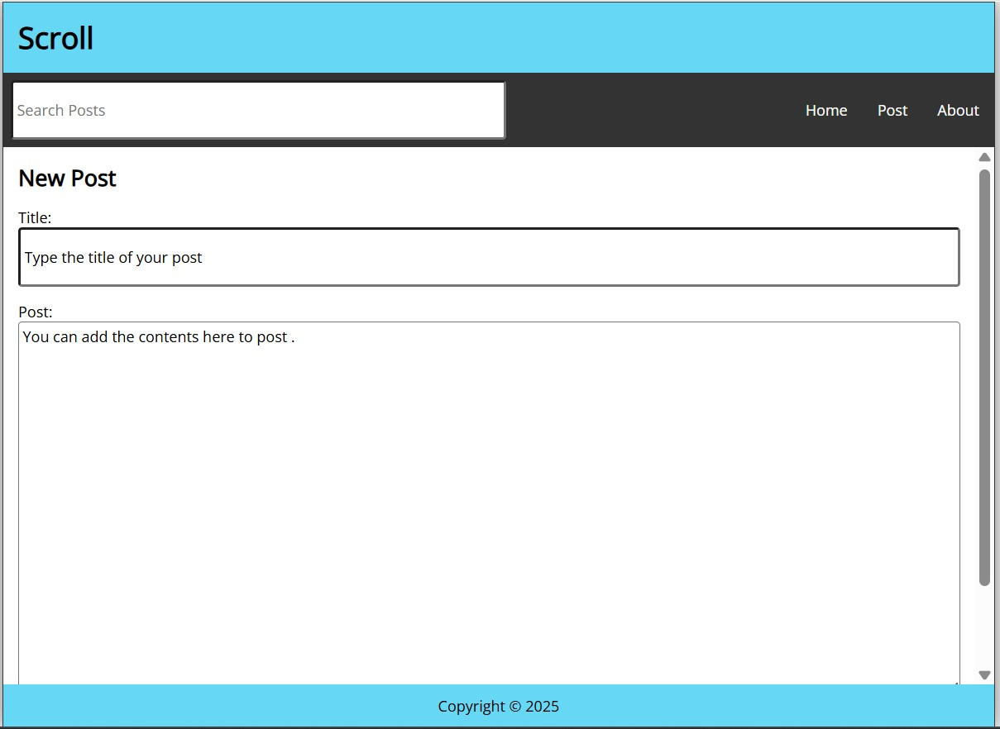
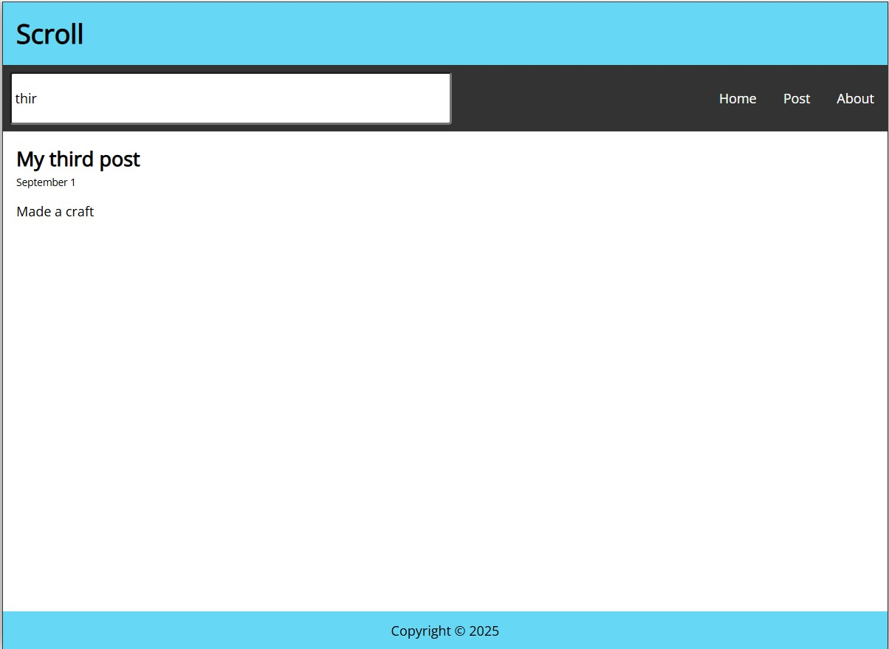
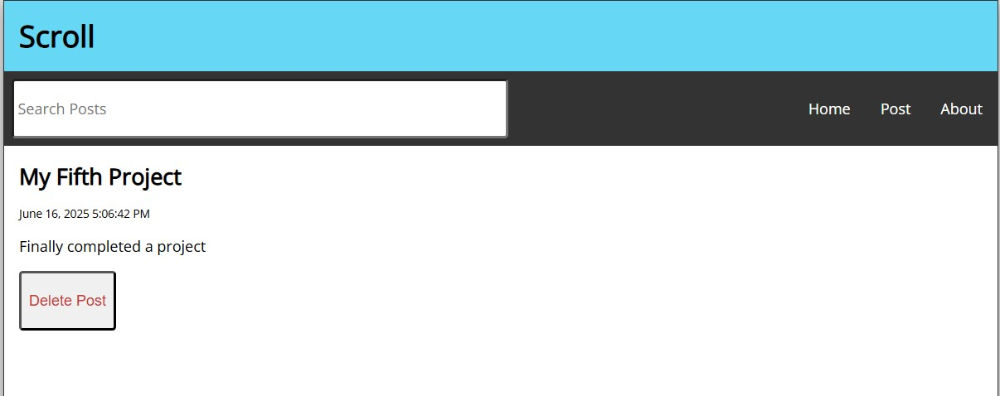

# 📝 Scroll - React Blog App

Scroll is a simple and clean blog application built using **React** and **CSS**, where users can:

- 🧠 Create posts (with title and body)
- 🗑️ Delete posts
- 🔍 Search posts in real-time
- 💾 Store data in the browser using `localStorage`

---

## 🚀 Features

- ✅ Add a new post (title + body)
- ✅ Delete a post
- ✅ Search posts by title or body
- ✅ Responsive and clean UI
- ✅ Routing with `react-router-dom`
- ✅ Data persistence using `localStorage`

---

## 🛠️ Tech Stack

- ⚛️ React
- 🎨 CSS
- 🗂️ localStorage (for storing posts)

---

## 📸 Screenshots

---

## 🌐 Live Demo

🔗 [Visit Scroll Blog App](https://react-social-web.netlify.app)

---